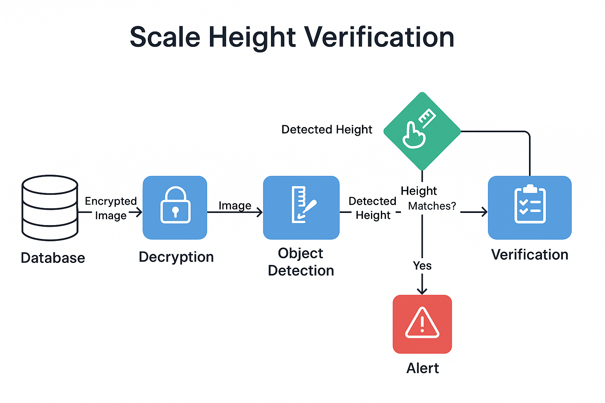

# 📏 Scale Height Verification

An automated system that fetches encrypted height measurement images from a database, decrypts them, and processes them using custom object detection models to determine actual candidate height. It cross-verifies the estimated height against stored data to catch calibration errors or manual entry mismatches.

---

## 📌 Overview

**Scale Height Verification** is a backend validation pipeline that detects height using a visual scale and pointer system captured in an image. The system uses lightweight SSD object detection models to extract pointer and scale regions, calculate height, and compare it against the stored value in the database. Alerts are raised if mismatches occur due to calibration or manual data issues.

> ⚠️ This repository contains only the README and architectural flow for understanding the system design. No datasets, models, or code are included due to company restrictions.

---

## 🔁 Key Features

- 🗃️ **Encrypted Image Retrieval** – Periodically fetches new encrypted images from a database
- 🔐 **Decryption Pipeline** – Converts encrypted images into processable image data
- 🎯 **Custom Height Detection Models** – Three SSD-based models extract scale, pointer, and background regions
- 📏 **Height Estimation** – Calculates height in cm/inches based on pointer position relative to the scale
- 🔍 **Cross Verification** – Compares with stored DB values for discrepancy checks
- 🚨 **Alert System** – Flags mismatches or suspicious calibration errors for manual review

---

## 🧠 Architecture

  
*Note: Temporary architecture — final version coming soon.*

---

## 🛠 Tech Stack

| Component           | Tool/Library              |
|--------------------|---------------------------|
| Language            | Python                    |
| Detection Models    | SSD (custom-trained)      |
| Image Processing    | OpenCV                    |
| Database Access     | MySQL / MSSQL (flexible)  |
| Decryption          | Python Cryptography       |
| Backend Execution   | Flask / Scheduled Script  |

---

## 🎯 Objective

To ensure reliable and automated height verification for candidate evaluation images, and to eliminate risks of human error or improper calibration in height entry workflows.

---

## 🔄 Pipeline Overview

1. **📥 Image Fetch**  
   System polls the database to retrieve newly added encrypted images.

2. **🔓 Image Decryption**  
   Each image is securely decrypted using a dedicated cryptography module.

3. **🧠 Height Region Detection**  
   Three custom SSD models detect:
   - Measuring scale region
   - Pointer marking candidate height
   - Background/boundary for perspective correction

4. **📏 Height Calculation**  
   Uses the pixel ratio between the scale markings to compute real-world height.

5. **📊 Database Comparison**  
   The calculated height is matched against the stored height value for the application number.

6. **🚨 Alert Triggering**  
   If there’s a mismatch beyond threshold, an alert is logged for human review.

---

## 📥 Example Output (Simulated)

```json
{
  "application_id": "APP_20250401_1043",
  "calculated_height_cm": 172.6,
  "stored_height_cm": 168.0,
  "mismatch": true,
  "alert": "Height mismatch exceeds threshold. Manual check required."
}
```
---

## 🧾 Use Cases

- ✅ **Candidate Screening**  
  Automate height validation in recruitment, sports tryouts, or fitness assessments.

- ✅ **Quality Check in Institutions**  
  Ensure measuring scale readings are accurately reflected in backend data.

- ✅ **Digital Archiving & Re-audit**  
  Reprocess archived form images to validate historical height records.

---

## 🔒 Disclaimer

This repository demonstrates a professional-grade application structure and processing pipeline.  
It **does not include** proprietary data, production-trained models, or confidential credentials.  
You are free to adapt the structure, pipeline logic, and modular components for educational, testing, or private deployments.

---

## 👨‍💻 Author

**Goutham Sidhik**  
AI/ML Engineer | Computer Vision & GenAI Developer  
[LinkedIn](https://www.linkedin.com/in/goutham-sidhik-amuluru-50231b163/)
